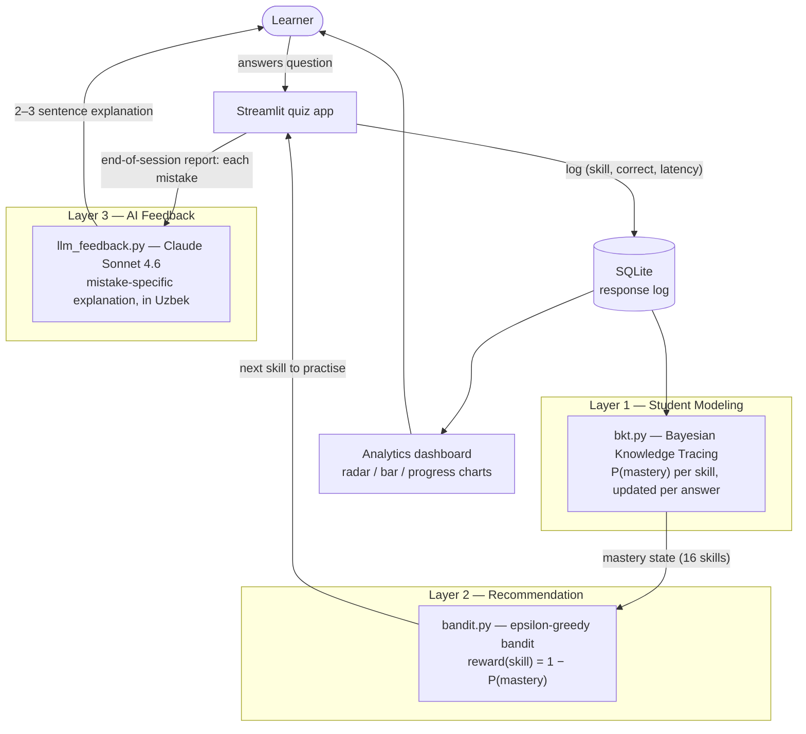

# AdaptivPrep


[](https://github.com/urrra39/AdaptivPrep/actions/workflows/tests.yml)


**An AI-powered adaptive learning system for IELTS preparation.** AdaptivPrep models a learner's mastery of every skill in real time with Bayesian Knowledge Tracing, uses a multi-armed bandit to always serve the *most valuable next question*, and generates mistake-specific explanations in Uzbek with Claude. In simulation, the adaptive policy reaches **+17.6% higher final mastery than random practice** (Cohen's d = 1.26) for the same number of questions.

---

## The problem

Most students preparing for IELTS (or SAT, or olympiads) review *everything with the same intensity* — splitting time equally between topics they already know and their actual weak points. Every question spent on a mastered topic teaches nothing. The waste is measurable: in our simulation, random practice spends **55.6%** of its questions on already-learned skills.

**AdaptivPrep closes that loop.** After every answer it re-estimates what the learner knows, then routes the next question to where learning value is highest.

## The adaptive loop



The architecture is **domain-agnostic**: the entire IELTS domain lives in `data/skills.json` (18 skills, including long-form reading ingested from ELS *English Through Reading*) and `data/questions.json` (70 questions). Swapping in SAT math or olympiad chemistry changes those two files and nothing else.

## The science

### Layer 1 — Bayesian Knowledge Tracing (Corbett & Anderson, 1995)

Each skill is an independent two-state hidden Markov model: the learner has either mastered the skill (latent state $L$) or not. Four parameters govern it: $P(L_0)$ (initial mastery), $\tau$ (learning rate), $g$ (guess), $s$ (slip). After each observed answer, the mastery estimate updates in two steps.

**Evidence (Bayes' rule):**

$$P(L_t \mid \text{correct}) = \frac{P(L_t)\,(1-s)}{P(L_t)\,(1-s) + \bigl(1-P(L_t)\bigr)\,g}$$

$$P(L_t \mid \text{incorrect}) = \frac{P(L_t)\,s}{P(L_t)\,s + \bigl(1-P(L_t)\bigr)\,(1-g)}$$

**Learning transition** (practice teaches, regardless of the answer):

$$P(L_{t+1}) = P(L_t \mid \text{obs}) + \bigl(1 - P(L_t \mid \text{obs})\bigr)\,\tau$$

**Next-answer prediction** (marginalising over the latent state):

$$P(\text{correct}_t) = P(L_t)\,(1-s) + \bigl(1-P(L_t)\bigr)\,g$$

Defaults: $P(L_0)=0.30$, $\tau=0.15$, $s=0.10$, and $g=0.25$ — principled for 4-option multiple choice (uniform random guessing). Parameters are validated with the identifiability guard $g+s<1$ (beyond it, a correct answer would count as evidence *against* mastery).

*Why BKT and not Deep Knowledge Tracing?* DKT (Piech et al., 2015) needs training data from hundreds of learners; BKT produces sensible, interpretable estimates from the very first user. DKT is the planned Phase-10 upgrade once real usage data accumulates.

### Layer 2 — Multi-armed bandit recommendation

Each skill is an arm; the utility of pulling arm $k$ (asking one question on skill $k$) is the expected learning opportunity:

$$r(k) = 1 - P(L^{(k)})$$

The **epsilon-greedy policy** balances the exploration–exploitation dilemma: with probability $1-\varepsilon$ it *exploits* (drills the weakest skill, ties broken uniformly), and with probability $\varepsilon = 0.15$ it *explores* (uniform random skill), keeping mastery estimates fresh for skills the greedy path would starve — estimates built from noisy binary answers go stale if never revisited.

*Why a bandit and not full deep RL?* At cold start, per-user data is sparse; bandit policies are statistically stable from the first interaction, while value-based RL needs many episodes before its policy is trustworthy. A **Thompson sampling** policy (posterior sampling over the BKT belief state — exploration allocated by uncertainty, zero hyperparameters) ships alongside ε-greedy behind the same `select_skill` interface; UCB slots in the same way.

### Layer 3 — LLM feedback (Claude Sonnet 4.6)

On a wrong answer, the system sends the question, the learner's exact distractor, and the correct option to Claude, which returns a 2–3 sentence explanation **in Uzbek** targeting that specific misconception — English is kept only for the linguistic material being taught. Failures (rate limits, timeouts, missing key) degrade gracefully to a static fallback; the tutor never crashes on the API's account.

## Empirical evaluation

All numbers regenerate exactly with `python -m src.evaluation.policy_eval` (fixed seeds, no wall-clock inputs). Full report: [`docs/evaluation_results.md`](docs/evaluation_results.md).

### Does BKT predict learner behaviour?

Prequential (predict-then-update) protocol — every prediction is emitted strictly *before* its label, so train/test leakage is impossible. Evaluated on a synthetic cohort of 150 students under deliberate parameter misspecification (the tutor never sees a student's true parameters).

| Metric | Value | Reference point |
|---|---|---|
| **AUC-ROC** (Mann-Whitney, tie-corrected) | **0.728** | 0.500 = chance; literature BKT fits ~0.65–0.75 |
| Log-loss | 0.593 | proper scoring rule; audits calibration |
| Brier score | 0.205 | 0.25 = always predicting 0.5 |
| Accuracy @0.5 | 0.679 | base rate 0.562 |
| Predictions scored | 12,000 | |

### Does adaptive selection beat random practice?

Paired simulation — 300 synthetic students × 120 questions × 18 skills, identical student populations per policy. `oracle` reads the hidden ground-truth state and is the ceiling for any observation-based policy.

| Policy | N=30 | N=60 | N=90 | N=120 | final ± 95% CI | wasted questions |
|---|---|---|---|---|---|---|
| random | 0.456 | 0.577 | 0.676 | 0.745 | 0.745 ± 0.012 | 55.6% |
| **bandit (ε-greedy)** | 0.479 | 0.642 | 0.784 | **0.876** | 0.876 ± 0.012 | 38.5% |
| thompson | 0.458 | 0.613 | 0.746 | 0.857 | 0.857 ± 0.012 | 40.9% |
| oracle | 0.536 | 0.769 | 0.921 | 0.982 | 0.982 ± 0.006 | 27.5% |

**The ε-greedy bandit achieves +17.6% relative final mastery over random (Cohen's d = 1.26) and captures 55% of the oracle–random gap while observing only binary answers.** Thompson sampling is close behind (−2.2%, d = −0.18) with zero exploration hyperparameters — probability matching allocates exploration by posterior uncertainty instead of a flat ε.

## Features

- 🎯 **Adaptive question routing** — every question targets the current weakest skill (with calibrated exploration)
- 🕶️ **Blind test mode** — exam-realistic sessions: no correctness signal mid-test, live timer, 10/50/50 Reading/Grammar/Vocabulary quotas, strict no-repeat sampling
- 📈 **Live mastery model** — 18 IELTS skills (grammar, vocabulary, and real ELS reading passages), updated in O(1) per answer
- 🎓 **AI feedback in Uzbek** — mistake-specific explanations in the end-of-session report, built for the Uzbek IELTS-prep community
- 📊 **Analytics dashboard** — radar knowledge profile, category aggregates, observed-vs-modelled progress curves
- 🔬 **Evaluation sandbox** — reproducible AUC + policy benchmarks with paired-design statistics
- ✅ **85 passing tests** — hand-computed Bayesian updates, policy mixture rates, probability-matching rates, API failure modes, data integrity

## Tech stack

| Layer | Technology |
|---|---|
| Student modeling | Pure-Python BKT (no ML deps — interpretable and auditable) |
| Recommendation | Epsilon-greedy + Thompson sampling bandits, injectable seeded RNG |
| AI feedback | Anthropic API — `claude-sonnet-4-6` |
| UI | Streamlit (quiz + dashboard), Plotly charts |
| Persistence | SQLite (indexed response log) |
| Testing | pytest — 85 tests, zero network calls |

## Getting started

```bash
git clone https://github.com/urrra39/AdaptivPrep.git
cd AdaptivPrep
python -m venv .venv
.venv/Scripts/activate          # Windows  (Linux/macOS: source .venv/bin/activate)
pip install -r requirements.txt

# Optional — enables AI feedback:
cp .env.example .env             # then paste your ANTHROPIC_API_KEY

# Run the quiz
streamlit run src/app/quiz_app.py
# Run the analytics dashboard
streamlit run src/app/dashboard.py
# Run the test suite
pytest
# Regenerate the evaluation report
python -m src.evaluation.policy_eval
```

## Deployment (Streamlit Community Cloud)

1. Fork/point Streamlit Cloud at this repo, main file `src/app/quiz_app.py` (deploy the dashboard as a second app from `src/app/dashboard.py`).
2. **No API key needed from the deployer** — each visitor pastes their own Anthropic key in the app's sidebar (used only for their session, never stored). Optionally, add `ANTHROPIC_API_KEY` in the **Secrets** UI to provide a default key for all visitors.
3. Note the storage caveat under Limitations: Cloud filesystems are **ephemeral**, so the SQLite log resets on redeploy. Set `ADAPTIVPREP_DB` to point elsewhere if you attach persistent storage.
4. **Login uses a per-username PIN.** On first use a visitor picks a username and sets a 4-digit PIN; returning to that username requires that PIN (wrong PIN → no login). The same PIN also gates that user's analytics dashboard. This is collision prevention for a shared demo, not full authentication.

## Project structure

```
adaptivprep/
├── data/                    # the entire domain — swap these to change subject
│   ├── skills.json          #   18-skill taxonomy (incl. ELS reading)
│   └── questions.json       #   70-question bank (passage_text on reading items)
├── src/
│   ├── models/
│   │   ├── bkt.py           # Layer 1 — Bayesian Knowledge Tracing
│   │   └── bandit.py        # Layer 2 — epsilon-greedy recommendation
│   ├── feedback/
│   │   └── llm_feedback.py  # Layer 3 — Claude-powered Uzbek explanations
│   ├── data/
│   │   ├── schema.py        # SQLite schema + persistence helpers
│   │   └── loader.py        # cached content-bank access
│   ├── app/
│   │   ├── quiz_app.py      # adaptive quiz (Streamlit)
│   │   └── dashboard.py     # analytics (Streamlit + Plotly)
│   └── evaluation/
│       ├── kt_eval.py       # prequential AUC / log-loss / Brier
│       └── policy_eval.py   # synthetic-student policy benchmark
├── tests/                   # 85 tests across 5 suites
└── docs/
    ├── architecture.md      # detailed system flowcharts
    └── evaluation_results.md
```

## Limitations

- **Evaluation is simulation-based** so far: synthetic students follow the BKT generative process (with per-student parameter misspecification), which favours BKT structurally. Real-user validation is the immediate next step once data accumulates.
- **BKT parameters are literature defaults**, not fitted. Per-skill fitting (EM / grid search) becomes possible — and the `per_skill_params` hook already exists — once real logs are collected.
- **SQLite on Cloud is ephemeral** — fine for a demo, wrong for production; a managed Postgres swap is isolated behind `src/data/schema.py`.
- **One skill per question**; real items often exercise several skills at once (the DKT upgrade addresses this).

## Roadmap

- **Deep Knowledge Tracing** (`src/models/dkt.py`, PyTorch LSTM) once real response volume supports it, benchmarked against BKT with the existing prequential harness
- **UCB** behind the existing `select_skill` interface (Thompson sampling already shipped and benchmarked)
- **BKT parameter fitting** (per-skill EM) from accumulated logs
- **Spaced repetition** — add a forgetting term so mastery decays between sessions

## Citations

- Corbett, A. T., & Anderson, J. R. (1995). *Knowledge tracing: Modeling the acquisition of procedural knowledge.* User Modeling and User-Adapted Interaction, 4(4), 253–278.
- Piech, C., Bassen, J., Huang, J., Ganguli, S., Sahami, M., Guibas, L., & Sohl-Dickstein, J. (2015). *Deep Knowledge Tracing.* NeurIPS 28.
- Clement, B., Roy, D., Oudeyer, P.-Y., & Lopes, M. (2015). *Multi-Armed Bandits for Intelligent Tutoring Systems.* Journal of Educational Data Mining, 7(2), 20–48.

## License

MIT — see [LICENSE](LICENSE).
