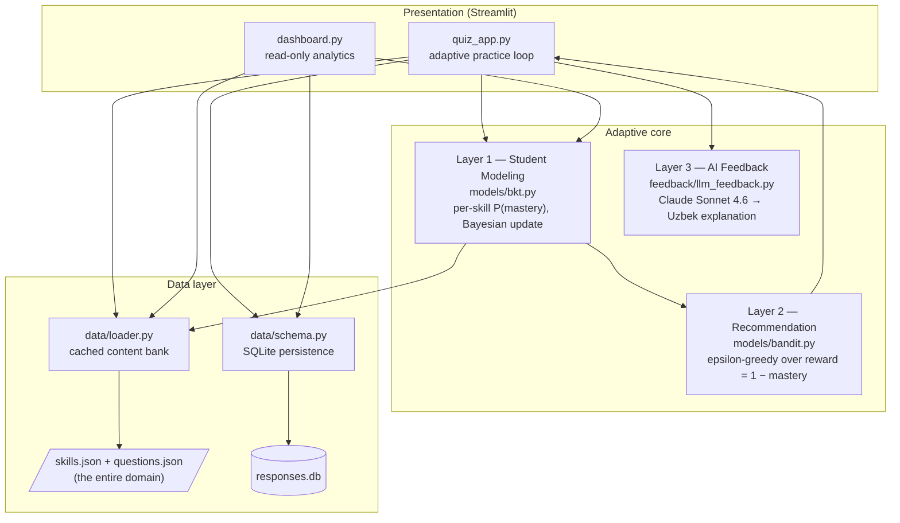
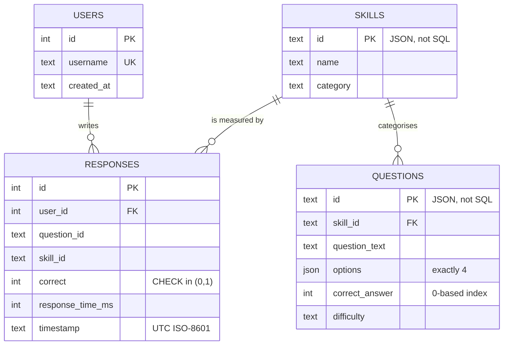
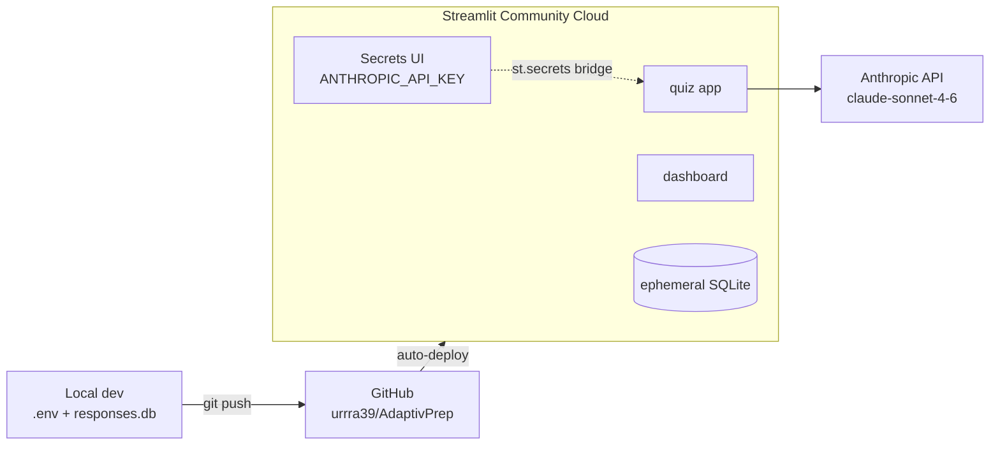

# AdaptivPrep — System Architecture

This document details the three-layer architecture, the runtime flow of a
single question cycle, the data model, and the load-bearing design decisions.
For the scientific background and empirical results, see the
[README](../README.md) and [evaluation_results.md](evaluation_results.md).

## 1. Three-layer architecture



**Dependency direction is strictly downward** — models depend on the data
layer, apps depend on both; nothing imports upward. The two Streamlit apps
share no state except SQLite, so the dashboard runs safely beside a live
quiz session (it is a pure reader with a 30 s cache).

## 2. One question cycle (runtime sequence)

```mermaid
sequenceDiagram
    autonumber
    actor S as Learner
    participant Q as quiz_app
    participant B as Bandit (L2)
    participant K as BKT (L1)
    participant D as SQLite
    participant C as Claude (L3)

    Q->>B: select_skill(mastery state)
    Note over B: explore w.p. ε=0.15, else argmax(1−mastery)
    B-->>Q: skill_id
    Q->>Q: pick unseen question within skill
    S->>Q: answer (choice + latency)
    Q->>D: record_response(user, question, skill, correct, ms)
    Q->>K: update(mastery[skill], correct)
    Note over K: Bayes evidence step, then learning transition —<br/>identical arithmetic to full-history replay
    K-->>Q: new mastery[skill]
    alt answer was wrong
        Q->>C: question + chosen distractor + correct option
        C-->>Q: 2–3 sentence explanation (Uzbek)
        Note over Q,C: any API failure → static fallback,<br/>logged in English; lesson never crashes
    end
    Q-->>S: verdict + mastery % + feedback, next question
```

Mastery is rebuilt from the full log **once at login** (`get_mastery`), then
maintained incrementally in O(1) per answer — the two paths use the same
update rule, and a dashboard cross-check asserts they agree to 1e-12.

## 3. Data model



The static content bank (skills, questions) lives in version-controlled JSON
— it is reviewable in pull requests and swappable per domain. Only *learner
events* live in SQLite. Indexes on `(user_id)`, `(skill_id)` and
`(user_id, skill_id)` keep the per-user replay that BKT performs at login
O(log n) to locate and linear to scan.

## 4. Module map

| Module | Role | Key invariant |
|---|---|---|
| `models/bkt.py` | Mastery estimation | `p_guess + p_slip < 1` enforced; update pinned by hand-computed tests |
| `models/bandit.py` | Skill selection | stateless w.r.t. reward (recomputed from live mastery each call); seeded RNG injectable |
| `feedback/llm_feedback.py` | Explanations | returns `None` on *any* failure; callers always have a fallback |
| `data/schema.py` | Persistence | all writes parameterised; `correct` constrained at the DB level |
| `data/loader.py` | Content access | single JSON parse per process (`lru_cache`) |
| `app/quiz_app.py` | Practice loop | in-memory mastery ≡ DB replay (same update rule) |
| `app/dashboard.py` | Analytics | read-only; never writes |
| `evaluation/kt_eval.py` | Model quality | predictions emitted strictly before labels |
| `evaluation/policy_eval.py` | Policy quality | paired student populations across policies |

## 5. Design decisions

| Decision | Alternative rejected | Rationale |
|---|---|---|
| BKT first | DKT (LSTM) | works from the first learner; 4 interpretable parameters; DKT needs hundreds of users' data (Phase 10) |
| Epsilon-greedy bandit | full deep RL | statistically stable under cold-start data sparsity; RL needs many episodes to trust |
| Reward = 1 − mastery | reward = observed error rate | mastery is denoised by the guess/slip model; raw error rate confounds not-knowing with slipping |
| One shared BKT parameter set | per-skill fitted params | no real data to fit yet; `per_skill_params` hook exists for Phase 10 EM fitting |
| JSON content bank | questions in SQL | domain becomes a reviewable, swappable artifact; DB holds only events |
| SQLite | Postgres | zero-ops for a demo; swap is isolated behind `schema.py` |
| Uzbek UI + feedback, English content | all-English | IELTS content must be English; mother-tongue explanations are the underserved value |
| Secrets via env + `st.secrets` bridge | hardcoded config | `.env` locally, Secrets UI on Cloud; the feedback module stays framework-agnostic |

## 6. Deployment topology



Cloud storage is ephemeral: the response log resets on redeploy. This is
acceptable for a portfolio demo and called out in the README; the
`ADAPTIVPREP_DB` environment variable relocates the database if persistent
storage is attached, and a Postgres migration would touch only
`data/schema.py`.
